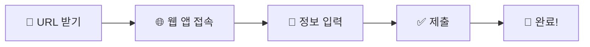
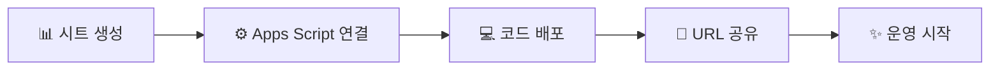

<div align="center">

# ⏰ Time Off Request Web App

[](https://script.google.com/)
[](https://sheets.google.com/)
[](https://mail.google.com/)

### 🎯 20인 미만 소규모 조직을 위한 스마트한 휴가 관리 솔루션

**복잡한 HR 시스템은 그만! 구글 워크스페이스로 5분 만에 시작하세요** ✨

[🚀 빠른 시작](#-빠른-시작) • [📚 문서 보기](./docs) • [🐛 버그 제보](../../issues) • [💡 기능 제안](../../issues/new)


---

</div>

## ✨ 왜 Time Off Request Web App인가요?

<table>
<tr>
<td width="33%" align="center">
<h3>🚀 빠른 도입</h3>
복잡한 설치 과정 없이<br/>
5분이면 바로 사용 가능
</td>
<td width="33%" align="center">
<h3>💰 완전 무료</h3>
Google Workspace만 있으면<br/>
추가 비용 제로
</td>
<td width="33%" align="center">
<h3>📱 언제 어디서나</h3>
PC, 모바일, 태블릿<br/>
모든 기기에서 접근
</td>
</tr>
</table>

---

## 🎁 주요 기능

<details open>
<summary><b>📝 직관적인 휴가 신청</b></summary>
<br/>

- ✅ 깔끔한 웹 폼 인터페이스
- ✅ 클릭 몇 번이면 신청 완료
- ✅ 실시간 유효성 검사
- ✅ 모바일 최적화 UI

</details>

<details open>
<summary><b>📊 자동화된 데이터 관리</b></summary>
<br/>

- ✅ Google Sheets에 자동 저장
- ✅ 실시간 동기화
- ✅ 손쉬운 데이터 추출 및 분석
- ✅ 엑셀 호환 가능

</details>

<details open>
<summary><b>📧 스마트 알림 시스템</b></summary>
<br/>

- ✅ 신청 완료 시 자동 이메일 발송
- ✅ 승인/반려 결과 즉시 통보
- ✅ 관리자에게 신청 알림
- ✅ 커스터마이징 가능한 이메일 템플릿

</details>

<details open>
<summary><b>👥 효율적인 승인 프로세스</b></summary>
<br/>

- ✅ 시트에서 바로 승인/반려 처리
- ✅ 승인 이력 자동 기록
- ✅ 다단계 승인 설정 가능
- ✅ 관리자 권한 관리

</details>

---

## 🚀 빠른 시작

### 👤 사용자 가이드 (휴가 신청)



1. **웹 앱 접속** - 관리자로부터 받은 URL 클릭 또는 마켓플레이스에서 앱 설치
2. **정보 입력** - 휴가 종류, 기간, 사유 등 입력
3. **제출** - 한 번의 클릭으로 신청 완료
4. **알림 수신** - 이메일로 신청 확인 및 결과 통보

### 🔧 관리자 가이드 (초기 설정)



1. **Google Sheets 생성** - 새 스프레드시트 만들기
2. **Apps Script 연결** - 확장 프로그램 > Apps Script
3. **코드 작성** - 제공된 코드 복사/붙여넣기
4. **웹 앱 배포** - 배포 > 새 배포
5. **URL 공유** - 팀원들에게 웹 앱 링크 전달

> 💡 **자세한 설정 가이드는 [docs 폴더](./docs)를 참고하세요!**

---

## 📊 시스템 아키텍처

```
┌─────────────────┐
│   👤 사용자      │
│  (Web Browser)  │
└────────┬────────┘
         │
         ▼
┌─────────────────────────────────┐
│  🌐 Google Apps Script Web App   │
│  ┌───────────┬─────────────┐    │
│  │  📝 Form  │ ⚙️ Backend  │    │
│  └───────────┴─────────────┘    │
└──────┬──────────────┬───────────┘
       │              │
       ▼              ▼
┌─────────────┐  ┌──────────┐
│ 📊 Sheets   │  │ 📧 Gmail │
│ (Database)  │  │ (Notify) │
└─────────────┘  └──────────┘
```

---

## 💻 기술 스택

<div align="center">

| Frontend | Backend | Database | Notification |
|:--------:|:-------:|:--------:|:------------:|
|  |  |  |  |
|  | | | |
|  | | | |

</div>

---

## 🎯 이런 조직에 딱 맞아요!

<table>
<tr>
<td width="33%" align="center">
<h3>🏢 스타트업</h3>

<br/><br/>
빠르게 성장하는 팀<br/>
유연한 근무 환경<br/>
간편한 관리 필요
</td>
<td width="33%" align="center">
<h3>👥 소규모 팀</h3>

<br/><br/>
20인 미만 조직<br/>
간단한 승인 프로세스<br/>
즉시 도입 가능
</td>
<td width="33%" align="center">
<h3>💰 예산 절감</h3>

<br/><br/>
무료 Google Workspace<br/>
추가 비용 없음<br/>
유지보수 불필요
</td>
</tr>
</table>

---

## 📁 프로젝트 구조

```
time-off-request-webapp/
├── 📄 README.md              # 프로젝트 소개
├── 📁 docs/                  # 상세 문서
│   ├── setup-guide.md       # 설치 가이드
│   ├── user-manual.md       # 사용자 매뉴얼
│   └── admin-guide.md       # 관리자 가이드
├── 📁 src/                   # 소스 코드
│   ├── Code.gs              # Apps Script 백엔드
│   ├── form.html            # 웹 폼 UI
│   └── styles.html          # CSS 스타일
└── 📁 examples/              # 예제 및 템플릿
    └── sample-sheet.xlsx    # 샘플 시트
```

---

## 🤝 기여하기

프로젝트 개선에 참여해주세요! 

1. 🍴 Fork the Project
2. 🌿 Create your Feature Branch (`git checkout -b feature/AmazingFeature`)
3. 💾 Commit your Changes (`git commit -m 'Add some AmazingFeature'`)
4. 📤 Push to the Branch (`git push origin feature/AmazingFeature`)
5. 🔃 Open a Pull Request

---

## 📞 지원 및 문의

<div align="center">

**문제가 발생했거나 도움이 필요하신가요?**

[](../../issues)
[](../../discussions)

</div>

---

## 📝 라이선스

이 프로젝트는 MIT 라이선스 하에 배포됩니다. 자세한 내용은 `LICENSE` 파일을 참조하세요.

---

<div align="center">

**⭐ 이 프로젝트가 도움이 되셨다면 Star를 눌러주세요! ⭐**

Made with ❤️ by J2DB Inc.

</div>
